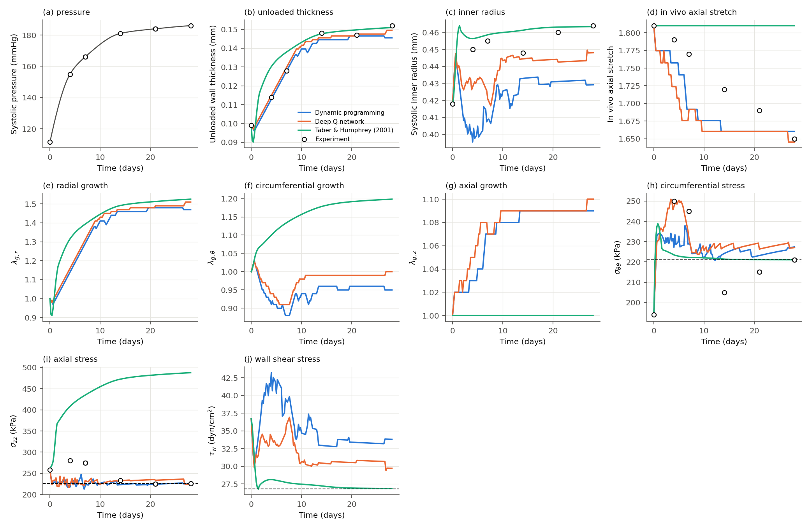

# RL growth laws for arteries, re-implemented in PyTorch

A re-implementation of

> M. Liu, L. Liang, H. Dong, W. Sun, R. L. Gleason, *Constructing growth evolution laws of arteries via
> reinforcement learning*, J. Mech. Phys. Solids (2022).

The original work was done in MATLAB with MDPtoolbox and the Reinforcement Learning Toolbox. This
version uses NumPy and SciPy for the mechanics and PyTorch for the deep Q network.

```
rl_growth/
  units.py                     mmHg -> kPa, Poiseuille wall shear stress (Eq. 4)
  mechanics/fourfiber.py       four-fiber family model + remodelling (Eqs. 19-20)
  mechanics/goh.py             Gasser-Ogden-Holzapfel model (Eq. 23)
  mechanics/thin_wall.py       thin-walled IAA: Laplace equilibrium, Eqs. 21-22 (batched bisection)
  mechanics/thick_wall.py      bi-layer thick wall: Eqs. 24-27, 5-pt Gauss quadrature, unloading, opening angles
  envs/iaa_env.py              Example-1 MDP (27 actions, state [s_tt, s_zz, tau_w], reward Eq. 13)
  envs/bilayer_env.py          Example-2 MDP per layer (9 actions, weighted distance)
  rl/dp.py                     policy iteration on the discrete growth grid (Eqs. 15-16)
  rl/dqn.py                    double DQN with soft target update (Eq. 17), batched environments
  rl/policies.py               nearest-state lookup of tabular policies, greedy Q policy (Eq. 18)
  baselines/                   Taber & Humphrey 2001 (Eq. 7), Liu et al. 2019 (Eqs. 8-9)
  data/bersi2017.py            approximate experimental values digitised from Figs. 6 and 8
  experiments/                 Example 1 (hypertension) and Example 2 (residual stress) drivers
  plotting.py                  figures mirroring Figs. 6-8 and 11-14
scripts/run_example1.py, scripts/run_example2.py
tests/test_mechanics.py        checks against numbers quoted in the paper
```

## Results at a glance

The figure below is the Example 1 output (hypertensive growth of the murine infrarenal abdominal
aorta over 28 days) from `scripts/run_example1.py --methods dp dqn th`, with the DQN trained for
the paper's 30 000 episodes.



The panels correspond to three figures of the paper, so they can be compared directly with the
[version of record](https://www.sciencedirect.com/science/article/pii/S002250962200223X):

| Panels here | Paper |
|---|---|
| (a) pressure, (b) unloaded thickness, (c) inner radius, (d) in vivo axial stretch | Fig. 6 (a)-(d) |
| (e) radial, (f) circumferential, (g) axial growth stretch | Fig. 7 (a)-(c) |
| (h) circumferential stress, (i) axial stress, (j) wall shear stress | Fig. 8 (a)-(c) |

Two things differ from the paper's plots. The paper also draws the constrained-mixture curve of
Latorre et al. (2019), which is not re-implemented here, and its Fig. 6 shows experimental error
bars where this figure shows only the digitised mean points.

## Running

Developed with Python 3.12. Install the dependencies into whatever environment you like:

```bash
pip install -r requirements.txt
```

Then, from the repository root:

```bash
python -m pytest tests                                   # ~2 s

# Example 1: hypertensive growth of the murine IAA
python scripts/run_example1.py --methods dp th           # DP + Taber-Humphrey, ~1 min
python scripts/run_example1.py --methods dp dqn th       # + DQN, 30 000 episodes (paper), ~1-2 h
python scripts/run_example1.py --methods dp dqn th --dqn-episodes 5000     # shorter DQN run
python scripts/run_example1.py --methods dp dqn th --load-dqn results/example1/dqn_agent.pt

# Example 2: residual stress in the bi-layer human ascending aorta
python scripts/run_example2.py --methods dp th liu       # ~1 min
python scripts/run_example2.py                           # + DQN (3 600 episodes per layer), ~20 min
```

Outputs go to `results/<example>/`: policies (`dp_policy*.npz`, `dqn_agent*.pt`), growth histories
(`sim_*.npz`), training curves and the comparison figures (`*.png`), plus `summary.json` (Example 2:
opening angles, loaded radii, final growth tensors). The `results/` directory checked in here holds
the runs described in the verification section below.

## What is implemented (mapping to the paper)

| Paper | Here |
|---|---|
| Kinematics F = Fe Fg, explicit Euler update of Fg (Sec. 2.1) | `experiments/*.simulate` |
| Thin-wall IAA equilibrium, Eqs. 21-22, material remodelling Eq. 20 | `ThinWallArtery.solve` |
| Bi-layer thick wall, Eqs. 24-27, Table 4 Gauss points | `BilayerAorta.evaluate / loaded` |
| Unloading (p = 0, zero axial force) and opening angles (+ zero moment) | `BilayerAorta.unloaded / opening_angle` |
| State s = [s_tt, s_zz, tau_w], 3 actions per direction with g = 0.01, reward beta1 ln d + beta2 (beta1 = -40, beta2 = 150, clipped to +-80), gamma = 0.99 | `envs/` |
| Termination: 500 steps or |ds_tt|, |ds_zz| >= 200 kPa, |dtau_w| >= 20 dyn/cm^2 | `GrowthEnvBase.is_terminal` |
| DP on 41^3 = 68 921 states (Ex. 1) and 21^2 = 441 states per layer (Ex. 2), nearest-state deployment | `rl/dp.py`, `NearestStatePolicy` |
| Double DQN, 2 hidden ReLU layers, Adam, experience replay, epsilon-greedy, target smoothing eta = 1e-4 | `rl/dqn.py` |
| Example 2 weights: tau_w weight 100 (media) / 33.3 (adventitia); training on Loc 3, deployment on all 5 points of both layers | `BilayerGrowthEnv`, `example2_residual_stress.simulate` |
| Expert laws Eq. 7 with (T_r, T_t, T_tau) = (0.3, 3, 5) days, Eq. 8 with alpha = (1e-3, 1e-3, 0, 1e-3), T = 1 day | `baselines/` |

## Implementation choices and deviations

The mechanics are vectorised, so the DQN steps `--dqn-n-envs` (default 64) independent episodes at
once and does `--dqn-updates-per-step` (default 4) gradient updates per batched step. This only
changes throughput; the algorithm is still the standard double DQN. The paper's 30 000 episodes take
roughly 1-2 h on a laptop CPU instead of 40 h.

Episodes start from a random state of the discrete growth grid, restricted to states inside the
termination thresholds. Most of the 68 921 IAA states lie far outside them and would end the episode
after a single step.

Near homeostasis the clipped reward makes several actions equally good, so policy iteration needs a
tie-breaking rule. Ties go to "no growth", which keeps the tissue quiescent at homeostasis instead
of oscillating. Without this the distributed policies of Example 2 drift.

The deployed DQN needs the same treatment. Its greedy policy picks "no growth" whenever that
action's Q value is within `--quiescence-tol` (default 3e-3, relative) of the best one. Example 1 is
insensitive to this setting. In Example 2 the plain argmax (`--quiescence-tol 0`) lets the ten
distributed agents drift collectively (loaded r_i goes from 7.99 to 7.40 mm after 4 days), while the
default keeps the diameter unchanged.

The paper does not give the network size or learning rate. I use 64-64 hidden units, lr 1e-3,
batch 64, a replay buffer of 1e6, and epsilon decaying from 1 to 0.01 over the first 30 % of planned
steps. Rewards are scaled by 1/80 inside the agent, which does not change the optimal policy.

For the Liu et al. (2019) law, the RL paper does not specify the exponent beta or the pause
threshold h0; beta = 1 and h0 = 0.5 are used (`--liu-h0`). The constrained-mixture model of Latorre
et al. (2019) shown in Fig. 6 is not re-implemented.

The experimental data (pressure schedule, thickness, radius, axial stretch, stresses) are read off
Figs. 6 and 8 and are approximate. Where the text gives exact values (day-0 geometry, homeostatic
stresses, day-0 pressure), those are used instead.

The opening angle follows Fung's definition: the angle between the two lines joining the mid-point
of the inner arc to its tips, so a closed ring has 0 deg. The sector angle is found by driving the
bending moment to zero with a bracketing scalar solve, with (rho_i, Lambda) obtained from radial and
axial equilibrium at each trial angle. For the grown states of Example 2 the cut sector is almost
stress free for *every* angle (|sigma| < 1.5 kPa), so the opening angle is very sensitive to small
differences in the growth field. See the results section.

Wall shear stress uses Q = 2.8 ml/min and mu = 4.5 cP for the IAA, and Q = 856.5 ml/min for the
human aorta. These reproduce the paper's tau_w,h = 26.8 and 1.6035 dyn/cm^2.

## Verification against the paper

* `BilayerAorta` with Fg = I gives r_i = 7.99 mm and layer-mean stresses (160.5, 102.0) kPa in the
  media and (56.1, 36.7) kPa in the adventitia (paper: 160.10, 101.87, 55.96, 36.70; Table 5).
* `ThinWallArtery` at day 0 gives r_i = 0.418 mm, s_tt = 194 kPa, s_zz = 260 kPa,
  tau_w = 36.7 dyn/cm^2, matching the day-0 points of Figs. 6 and 8.
* Taber & Humphrey law, Example 1: lam_g(28 d) = (1.53, 1.20, 1.00) with runaway s_zz
  (paper: lam_g,t = 1.20, s_zz off-scale in Fig. 8b). Example 2: lam_g,r at Loc 1 / Loc 5 of the
  media = 1.29 / 0.68 and lam_g,t = 1.03 / 0.97, identical to Figs. 13-14.
* Example 1 at day 28 (`results/example1`, DQN trained for the paper's 30 000 episodes, 27 min;
  see the figure above):

  | law | lam_g (r, t, z) | H unloaded (mm) | r_i (mm) | in vivo lam_z | (s_tt, s_zz, tau_w) |
  |---|---|---|---|---|---|
  | Dynamic programming | (1.47, 0.95, 1.09) | 0.146 | 0.429 | 1.66 | (227, 226, 33.8) |
  | Deep Q network | (1.51, 1.00, 1.10) | 0.149 | 0.448 | 1.645 | (227, 224, 29.7) |
  | Taber & Humphrey | (1.53, 1.20, 1.00) | 0.151 | 0.463 | 1.81 | (221, 488, 26.9) |
  | paper (DP / DQN) | lam_g,t = 1.05 / 1.04, lam_g,z = 1.11 / 1.10 | ~0.15 | ~0.46 | ~1.65 | restored |
  | experiment | - | 0.152 | 0.464 | 1.65 | (221, 226, 26.8) |

  Both RL laws reproduce the reduction of the in vivo axial stretch, the wall thickening and the
  transient peaks of r_i and tau_w seen in Figs. 6-8. The DP law restores tau_w less completely
  than in the paper (33.8 vs ~27 dyn/cm^2) because the nearest-state lookup transfers a
  normotensive policy to a hypertensive environment.
* Example 2 (`results/example2`, 3 600 DQN episodes per layer, ~8 min each):

  | law | opening angle media / adventitia (deg) | loaded r_i (mm) | layer-mean s_tt media / adv (kPa) |
  |---|---|---|---|
  | Dynamic programming | 87.1 / 31.3 | 7.993 | 160.1 / 56.2 |
  | Deep Q network | 87.3 / 37.4 | 7.985 | ~160 / ~56 |
  | Taber & Humphrey | 88.9 / 76.5 | 7.990 | 160.5 / 56.1 |
  | Liu et al. (2019) | 55.6 / 36.7 | 8.878 | 96 / 42 |
  | paper (DP / DQN / T&H / Liu) | 123.0 / 71.0, 123.0 / 71.4, 125.3 / 71.2, 40.3 / 38.6 | ~7.99 (RL, T&H), larger (Liu) | - |

  The qualitative picture of Figs. 11-14 and Table 6 is reproduced. The RL and Taber-Humphrey laws
  homogenise the stresses at homeostatic levels without changing the diameter. RL does so through
  circumferential growth only, adding volume at Loc 1 and removing it at Loc 5, whereas the
  Taber-Humphrey law thickens the inner wall and thins the outer one. The Liu law enlarges the
  vessel and gives compressive media / tensile adventitia residual stresses and the smallest opening
  angles. The absolute opening angles differ from Table 6 even though the Taber-Humphrey growth
  field is reproduced to three digits. As noted above, the cut sector is nearly stress free for
  every sector angle, so this number depends strongly on the integration and interpolation details.
